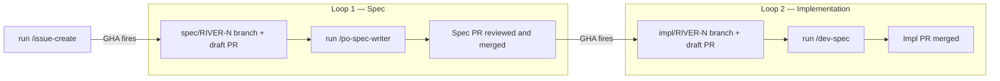
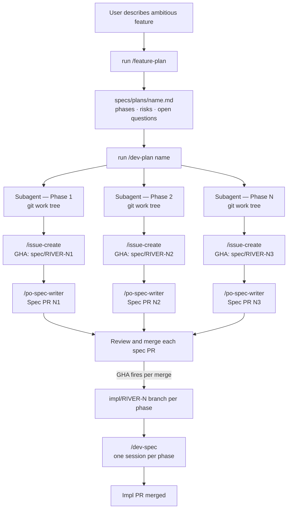

# Hybrid AI-Augmented Development — Experiment

## ⚠️ Usage notice ⚠️

This experiment uses Claude Code interactively under an individual Claude Pro subscription.

The purpose of the experiment is to explore and validate a structured, cost-effective AI-assisted development workflow. Claude Code Pro is used here as a practical execution environment during the research phase, with the expectation that similar workflows could later be migrated to API-based infrastructure and standard token billing if needed.

A key dimension being studied is the tradeoff between autonomy and cost efficiency. More autonomous execution loops reduce the amount of human intervention required per development cycle, improving throughput and consistency, but typically increase token usage due to longer agentic sessions, higher context retention, and iterative reasoning overhead.

Any use of Claude Code should comply with Anthropic’s Terms of Service, subscription limits, acceptable use policies, and any applicable Claude Code usage guidelines. This repository does not endorse account sharing, unattended autonomous operation, rate-limit evasion, or using Pro subscriptions as a replacement for enterprise/API infrastructure outside the intended terms of use.

---

## Introduction

This repo is a working experiment in a hybrid approach to AI-assisted software development.

Two common extremes exist today:

- Fully agentic: an autonomous agent manages the software workflow end-to-end with minimal human intervention. Promising in theory, but truly robust long-term production examples remain limited.

- Ad hoc AI-augmented: AI is used opportunistically to solve immediate tasks without a broader workflow structure. Fast to adopt, but often difficult to scale and sustain.

The hypothesis behind this project is that a structured middle ground can progressively move toward high autonomy while preserving stable quality, architectural continuity between iterations, and sustainable token economics. Humans remain responsible for key review and decision gates, while AI performs most of the execution within those constraints under direct developer supervision.

Existing tools like OpenSpec, SpecKit, and similar spec-authoring frameworks were considered. The deliberate choice here is to use Claude-native instruments like slash commands, memory, hooks, rather than external tooling. The goal is to understand what a fully Claude-native development workflow looks like, not to evaluate third-party spec tools. Of the available Claude Code integrations, only the [GitHub integration](https://github.github.com/gh-aw/) is used, as it provides the coordination base for the agentic workflow loops.

---

## How it works V0 — Single task

GitHub is the coordination layer. Claude Code (interactive Pro plan) is the execution layer. This experiment intentionally stays human-supervised rather than fully autonomous.

Roles (dev, QA, PO, etc.) interact only through GitHub issues. Two automated loops handle the rest.



### Loop 1 — Spec

A developer runs `/issue-create` in Claude Code. The skill prompts for category, priority, title, and body, then creates the GitHub issue with the correct labels. A GitHub Action fires immediately: it creates a `spec/RIVER-{N}` branch and a draft PR. The skill waits 30 seconds, finds the draft PR, and checks out the branch automatically.

The developer then runs:

```bash
/po-spec-writer
```

Claude reads the issue, writes the spec, and opens the PR for review. **This is the only code review gate** — the spec is the contract. Implementation is not started until the spec is approved.

### Loop 2 — Implementation

On spec merge, a second GHA fires: it creates `impl/RIVER-{N}` and a draft PR.

```bash
git checkout impl/RIVER-{N}
/dev-spec
```

Claude reads the merged spec, implements exactly what is in scope, writes tests, and updates the changelog. The impl PR has no code review — the spec already covered that.

---

## How it works V1 — Ambitious features

For large, multi-part features, V1 adds two commands that sit above the V0 loops and drive them in parallel.



### Step 1 — Plan the feature

```bash
/feature-plan
```

Claude asks for the feature name, why it matters, scope boundaries, and constraints. It then decomposes the feature into 3–6 phases — each independently shippable — with goals, ordered steps, dependencies, and done criteria. Risks and open questions are surfaced before any code is written. The plan is saved to `specs/plans/{name}.md`.

### Step 2 — Execute the plan

```bash
/dev-plan {name}
```

Claude reads the plan, shows all phases, and asks which to process and at what priority. It then spawns one parallel subagent per phase, each isolated in its own git work tree. Every subagent independently:

1. Creates a GitHub issue with the phase details
2. Waits for the GHA to create the `spec/RIVER-{N}` branch
3. Checks out the branch in its worktree
4. Runs `/po-spec-writer` to write the spec and open a PR

The result is one spec PR per phase, all open simultaneously, ready for review.

### Step 3 — Implement

Each spec PR follows the existing V0 Loop 2: merge triggers GHA, impl branch is created, developer runs `/dev-spec`. Phases can be implemented sequentially or in parallel depending on their declared dependencies.

---

## Results

### Week 2 — In progress: from linear tasks to plan-driven multi-agent mode

Week 1 validated that the V0 spec-first loop works well for single, well-scoped tasks. The bottleneck that emerged: ambitious features with 3–6 moving parts still required the developer to manually decompose the work, create one issue at a time, and run each spec session sequentially. The workflow was sound but not scalable to larger initiatives.

Week 2 focus: lift the workflow one level up. Instead of driving individual tasks, the developer now drives a plan — and agents do the decomposition, issue creation, and spec writing in parallel.

**What changed:**

Two new commands were added above the existing V0 loops:

- `/feature-plan` — interactive session that produces a phase-by-phase plan in `specs/plans/`. Claude asks for the why, scope boundaries, and constraints, then decomposes the feature into independently shippable phases with goals, steps, dependencies, done criteria, risks, and open questions.

- `/dev-plan {name}` — reads a saved plan and spawns one parallel subagent per phase. Each subagent runs in an isolated git work tree, creates the GitHub issue, waits for the GHA spec branch, and runs `/po-spec-writer`. The result: all spec PRs for a feature open simultaneously rather than one at a time.

**Routing guidance** was also added to `CLAUDE.md` so Claude proactively suggests the right command based on task size — `/issue-create` for small self-contained tasks, `/feature-plan` for anything that spans multiple components or requires design decisions first.

**Open questions being studied in week 2:**

- Token cost of parallel agentic sessions vs. sequential: does parallelism increase total spend or shift it?
- Quality of subagent-written specs vs. interactive specs: does removing the human from the loop in spec writing degrade the output?
- Merge conflict rate in tracking files (`QUEUE.md`, `HISTORY.md`) when multiple spec branches land close together.

---

### Week 1 — MVP done

6 days, 29 committed sessions, 2,762 assistant turns.

Built a working end-to-end observability pipeline with no custom frontend — Grafana as the UI layer. Components shipped: OTel sidecar, ingestion service, S3 batch storage, metrics aggregation, database migration management, query API, Grafana dashboards, and a full CI/CD setup. Test coverage above 80% (SonarQube gate).

Full token breakdown: [docs/token-usage.md](docs/token-usage.md)

**API-equivalent cost** (Sonnet 4.6 pricing — $3/1M input, $3.75/1M cache write, $0.30/1M cache read, $15/1M output):

| Token type | Volume | Cost | Share |
|------------|--------|-----:|------:|
| Cache reads | 190M | $57.06 | 49% |
| Output | 2.4M | $36.32 | 31% |
| Cache writes | 6.4M | $23.86 | 20% |
| Input | 16K | $0.05 | <1% |
| **Total** | | **$117.29** | |

[RTK](https://github.com/rtk-ai/rtk) was also used to compress tool results before they reached Claude — 210K additional input tokens avoided (~$0.63).

Advanced models such as Opus (which I have used in production contexts) are intentionally avoided, as they may introduce additional usage overhead that is not consistent with the objectives of this experiment. 

On the other hand, lower-tier models such as Haiku are also not fully optimal in terms of token efficiency and code quality for complex tasks; however, they will be evaluated in the second week of the experiment, specifically during the frontend application creation phase, to better understand their trade-offs in real-world usage scenarios.

**By phase:**

| Phase | Cost | Share |
|-------|-----:|------:|
| Implementation | $61.93 | 56% |
| Spec writing | $36.60 | 33% |
| Setup / tooling | $12.25 | 11% |

Spec writing is the cheapest phase — most spec sessions cost $0.35–$0.50 each. The outliers (`RIVER-6` at $16.84, `RIVER-22` at $13.30) were complex iterative specs with many rounds of context growth, not a structural problem with spec-first gating.

**Most expensive session**: `RIVER-6 — Setup DevOps part 2` at **$16.84** — 421 turns, 27.7M cache reads, long debug loop with growing context.

**Cheapest sessions**: simple spec writes at **$0.20–$0.35** each.

**By MoSCoW priority:**

MoSCoW labels are assigned when a spec is written. This makes it possible to see how much budget was spent on what the team decided was truly required vs. what was deferred.

| Priority | Cost | Share |
|----------|-----:|------:|
| must | $88.89 | 76% |
| should | $28.40 | 24% |
| could | — | — |
| wont | — | — |

**By category:**

| Category | Cost | Share |
|----------|-----:|------:|
| tools | $63.14 | 54% |
| features | $32.05 | 27% |
| bugs | $17.31 | 15% |
| docs | $2.95 | 3% |
| refactoring | $1.83 | 2% |

The tooling cost (54%) is high relative to features (27%) because the first week included bootstrapping the entire CI/CD pipeline, DevOps setup, and dev tooling from scratch — a one-time cost. Refactoring is cheapest because it was minimal; bugs are unexpectedly high, driven by the RIVER-22 error-linking spec which required deep context analysis.

---

## Why Claude Code Pro instead of API

Cost and stability. Claude Code Pro is a flat subscription with no per-token billing. For an experiment that runs many spec + impl cycles, this matters. The tradeoff is that it only runs interactively (not as a fully autonomous background agent) — which is actually fine for this hybrid model, since human checkpoints are the point.

---

## Spec structure

`specs/{priority}/{category}/RIVER-N-title.md`

| Priority | When |
|----------|------|
| `must` | Required for this iteration |
| `should` | Important but not blocking |
| `could` | Nice to have if time allows |
| `wont` | Explicitly out of scope |

| Category | Use for |
|----------|---------|
| `bugs` | Defects and regressions |
| `docs` | Documentation, guides |
| `features` | New capabilities |
| `refactoring` | Internal restructuring, no behavior change |
| `tools` | Dev tooling, CI, scripts |

---

## The project itself

River is an OpenTelemetry-based observability platform — infinitely scalable, deployable anywhere. It exists here primarily as the subject of the experiment, not the goal. For architecture and tech stack see [specs/SPEC.md](specs/SPEC.md).

---

## License

See [LICENSE](LICENSE).
