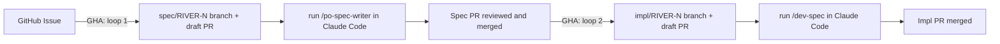

# Hybrid AI-Augmented Development — Experiment

This repo is a working experiment in a hybrid approach to AI-assisted software development.

Two common extremes exist today:

- Fully agentic: an autonomous agent manages the software workflow end-to-end with minimal human intervention. Promising in theory, but truly robust long-term production examples remain limited.

- Ad hoc AI-augmented: AI is used opportunistically to solve immediate tasks without a broader workflow structure. Fast to adopt, but often difficult to scale and sustain.

The hypothesis behind this project is that a structured middle ground can progressively move toward high autonomy while preserving stable quality, architectural continuity between iterations, and sustainable token economics. Humans remain responsible for key review and decision gates, while AI performs most of the execution within those constraints.

---

## How it works V0

GitHub is the coordination layer. Claude Code (Pro plan, no API token costs) is the execution layer. No extra tools.

Roles (dev, QA, PO, etc.) interact only through GitHub issues. Two automated loops handle the rest.



### Loop 1 — Spec

Anyone opens a GitHub issue with a title and a one-sentence problem statement. A GitHub Action fires immediately: it creates a `spec/RIVER-{N}` branch and a draft PR. No API key or labels needed.

A developer checks out the branch and runs:

```bash
git checkout spec/RIVER-{N}
/po-spec-writer
```

Claude reads the issue, writes the spec, and opens the PR for review. **This is the only code review gate** — the spec is the contract. Implementation is not started until the spec is approved.

### Loop 2 — Implementation

On spec merge, a second GHA fires: it creates `impl/RIVER-{N}` and a draft PR.

```bash
git checkout impl/RIVER-{N}
/dev-spec
```

Claude reads the merged spec, implements exactly what is in scope, writes tests, and updates the changelog. The impl PR has no code review — the spec already covered that.

---

## Results

### Week 1 — MVP done

6 days, 29 committed sessions, 2,762 assistant turns.

Built a working end-to-end observability pipeline with no custom frontend — Grafana as the UI layer. Components shipped: OTel sidecar, ingestion service, S3 batch storage, metrics aggregation, database migration management, query API, Grafana dashboards, and a full CI/CD setup. Test coverage above 80% (SonarQube gate).

Full token breakdown: [docs/token-usage.md](docs/token-usage.md)

**API-equivalent cost** (Sonnet 4.6 pricing — $3/1M input, $3.75/1M cache write, $0.30/1M cache read, $15/1M output):

| Token type | Volume | Cost | Share |
|------------|--------|-----:|------:|
| Cache reads | 180M | $54.10 | 49% |
| Output | 2.3M | $33.93 | 31% |
| Cache writes | 6.1M | $22.69 | 20% |
| Input | 15K | $0.05 | <1% |
| **Total** | | **$110.78** | |

Actual paid: **$20/month** flat (Claude Code Pro plan).

**By phase:**

| Phase | Cost | Share |
|-------|-----:|------:|
| Implementation | $61.93 | 56% |
| Spec writing | $36.60 | 33% |
| Setup / tooling | $12.25 | 11% |

Spec writing is the cheapest phase — most spec sessions cost $0.35–$0.50 each. The outliers (`RIVER-6` at $16.84, `RIVER-22` at $13.30) were complex iterative specs with many rounds of context growth, not a structural problem with spec-first gating.

**Most expensive session**: `RIVER-6 — Setup DevOps part 2` at **$16.84** — 421 turns, 27.7M cache reads, long debug loop with growing context.

**Cheapest sessions**: simple spec writes at **$0.20–$0.35** each.

**By MoSCoW priority:**

MoSCoW labels are assigned when a spec is written. This makes it possible to see how much budget was spent on what the team decided was truly required vs. what was deferred.

| Priority | Cost | Share |
|----------|-----:|------:|
| must | $78.31 | 71% |
| should | $32.46 | 29% |
| could | — | — |
| wont | — | — |

**By category:**

| Category | Cost | Share |
|----------|-----:|------:|
| tools | $42.79 | 39% |
| features | $32.05 | 29% |
| bugs | $22.06 | 20% |
| docs | $12.73 | 11% |
| refactoring | $1.14 | 1% |

The tooling cost (39%) is high relative to features (29%) because the first week included bootstrapping the entire CI/CD pipeline, DevOps setup, and dev tooling from scratch — a one-time cost. Refactoring is cheapest because it was minimal; bugs are unexpectedly high, driven by the RIVER-22 error-linking spec which required deep context analysis.

---

## Why Claude Code Pro instead of API

Cost and stability. Claude Code Pro is a flat subscription with no per-token billing. For an experiment that runs many spec + impl cycles, this matters. The tradeoff is that it only runs interactively (not as a fully autonomous background agent) — which is actually fine for this hybrid model, since human checkpoints are the point.

---

## Spec structure

`specs/{priority}/{category}/RIVER-N-title.md`

| Priority | When |
|----------|------|
| `must` | Required for this iteration |
| `should` | Important but not blocking |
| `could` | Nice to have if time allows |
| `wont` | Explicitly out of scope |

| Category | Use for |
|----------|---------|
| `bugs` | Defects and regressions |
| `docs` | Documentation, guides |
| `features` | New capabilities |
| `refactoring` | Internal restructuring, no behavior change |
| `tools` | Dev tooling, CI, scripts |

---

## The project itself

River is an OpenTelemetry-based observability platform — infinitely scalable, deployable anywhere. It exists here primarily as the subject of the experiment, not the goal. For architecture and tech stack see [specs/SPEC.md](specs/SPEC.md).

---

## License

See [LICENSE](LICENSE).
