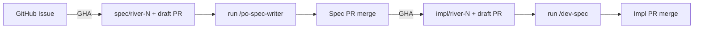

# Opentelemetry based observability platform

> Experimental. Open-source observability platform — infinitely scalable, deployable anywhere.

For architecture, tech stack, and project decisions see [specs/SPEC.md](specs/SPEC.md).

---

## Spec-Driven Development (SDD)

River uses SDD natively — no external project management tools, no ticket trackers, no extra frameworks. Specs, skills, and context files live in the repo and are read directly by Claude. The entire workflow runs inside Claude Code.

**The key idea: we review specs, not code.** A spec PR is reviewed before any implementation starts. Implementation goes through its own PR — but no code review, only the spec was the contract.

Work is linear — one spec at a time. Status lives in `specs/QUEUE.md` as a flat list; done tasks stay, marked with strikethrough.

### Workflow



### 1. Create a GitHub issue

Open an issue with:
- **Title** — short noun phrase
- **Body** — one sentence: the problem or goal (becomes the *Why*)

On issue open, GHA automatically creates branch `spec/RIVER-{number}`, adds a draft prompt to `specs/drafts/`, and opens a draft PR. No API key or labels needed.

### 2. Write the spec

Checkout the branch and open Claude Code:

```bash
git checkout spec/RIVER-{number}
/po-spec-writer
```

Claude reads the draft (task, title, why pre-filled from the issue) and asks only for priority, category, and test approach. It writes the spec to `specs/{priority}/{category}/`, updates `QUEUE.md`, and deletes the draft.

Push and mark the PR as ready for review.

### 3. Review

The PR is the spec contract — check before merging:
1. **Why line** — states the problem, not the solution. One sentence above `<!-- STOP -->`.
2. **Scope In** — every item is independently testable. Split if not.
3. **Scope Out** — explicitly lists what is deferred.

### 4. Implement

On spec PR merge, GHA automatically creates `impl/RIVER-{number}` branch and a draft PR. Checkout and run:

```bash
git checkout impl/RIVER-{number}
/dev-spec
```

Claude infers the task from the branch name, implements **Scope In**, marks the task done in `QUEUE.md`, appends to `HISTORY.md`, and opens an impl PR. Merge when ready.


### Spec path

`specs/{priority}/{category}/RIVER-N-title.md`

| Priority | When |
|----------|------|
| `must` | Required for this iteration |
| `should` | Important but not blocking |
| `could` | Nice to have if time allows |
| `wont` | Explicitly out of scope |

| Category | Use for |
|----------|---------|
| `bugs` | Defects and regressions |
| `docs` | Documentation, guides, reference material |
| `features` | New user-facing or operator-facing capabilities |
| `refactoring` | Internal restructuring with no behavior change |
| `tools` | Dev tooling, CI, scripts, skills |

---

## License

See [LICENSE](LICENSE).
