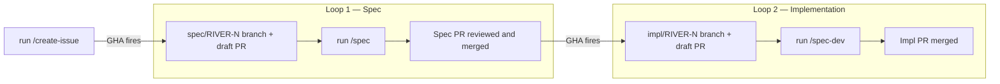

# How it works V0 — Single task

GitHub is the coordination layer. Claude Code (interactive Pro plan) is the execution layer. This experiment intentionally stays human-supervised rather than fully autonomous.

Roles (dev, QA, PO, etc.) interact only through GitHub issues. Two automated loops handle the rest.



## Loop 1 — Spec

A developer runs `/create-issue` in Claude Code. The skill prompts for category, priority, title, and body, then creates the GitHub issue with the correct labels. A GitHub Action fires immediately: it creates a `spec/RIVER-{N}` branch and a draft PR. The skill waits 30 seconds, finds the draft PR, and checks out the branch automatically.

The developer then runs:

```bash
/spec
```

Claude reads the issue, writes the spec, and opens the PR for review. **This is the only code review gate** — the spec is the contract. Implementation is not started until the spec is approved.

## Loop 2 — Implementation

On spec merge, a second GHA fires: it creates `impl/RIVER-{N}` and a draft PR.

```bash
git checkout impl/RIVER-{N}
/spec-dev
```

Claude reads the merged spec, implements exactly what is in scope, writes tests, and updates the changelog. The impl PR has no code review — the spec already covered that.
