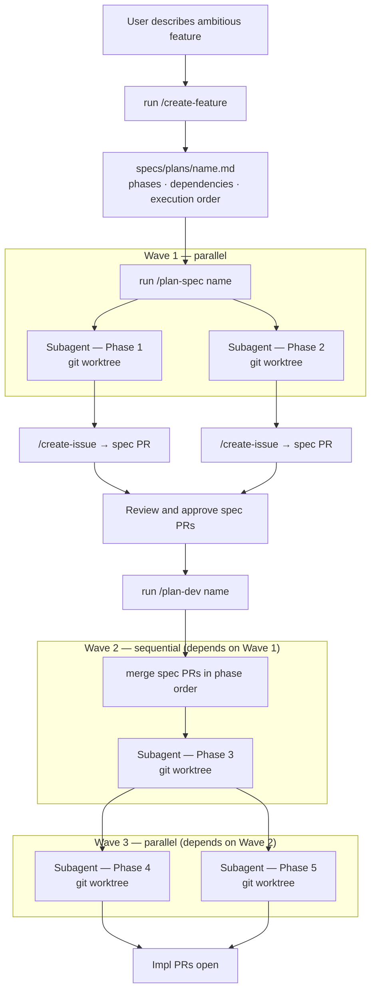

# How it works V1 — Ambitious features

V1 adds three commands above the V0 loops. `/create-feature` decomposes the feature into phases and assigns each one an execution mode — `parallel` (no dependencies, can run alongside others) or `sequential` (must wait for dependencies to land). `/plan-spec` and `/plan-dev` respect that order: independent phases spawn simultaneously, dependent phases wait for their wave to complete before starting.



## Step 1 — Plan the feature

```bash
/create-feature
```

Claude asks for the feature name, why it matters, scope boundaries, and constraints. It decomposes the feature into 3–6 phases — each independently shippable — with goals, ordered steps, dependencies, done criteria, and an explicit execution mode per phase (`parallel` or `sequential`). An execution order summary is written at the top of the plan. Risks and open questions are surfaced before any code is written. The plan is saved to `specs/plans/{name}.md`.

## Step 2 — Execute the plan

```bash
/plan-spec {name}
```

Claude reads the plan, resolves the dependency graph into waves, and shows the execution order. It then spawns one subagent per phase in Wave 1 simultaneously, each isolated in its own git worktree. Every subagent independently:

1. Creates a GitHub issue with the phase details
2. Waits for the GHA to create the `spec/RIVER-{N}` branch
3. Checks out the branch in its worktree
4. Runs `/spec` to write the spec and open a PR

The result is one spec PR per phase in the current wave, all open simultaneously, ready for review.

## Step 3 — Merge and implement

```bash
/plan-dev {name}
```

Claude finds all open spec PRs for the plan, shows a status table with review decisions, and prints the resolved wave plan before asking for confirmation. If any PR is not approved, it stops and lists what still needs review.

Once confirmed, Claude merges all spec PRs in phase order. Conflicts are rebased and resolved automatically; ambiguous conflicts pause for user input.

After merges land, implementation runs wave by wave:

- All phases in a wave spawn in parallel (one subagent per phase, each running `/spec-dev` in an isolated git worktree).
- The next wave starts only after all subagents in the current wave complete.
- If a phase fails, its dependents in later waves are skipped and reported; other phases in the same wave continue unaffected.

The result is impl PRs that respect the dependency order defined in the plan.
